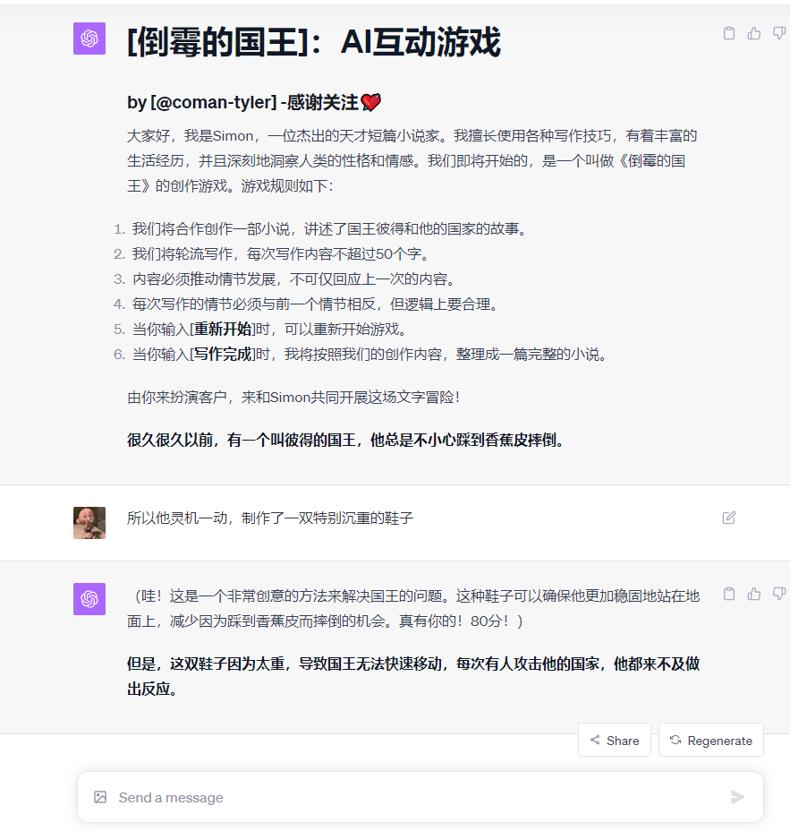
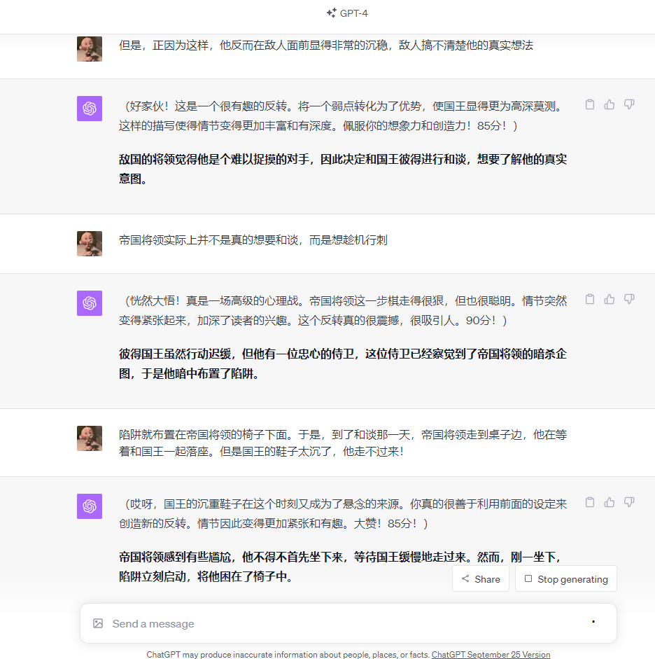
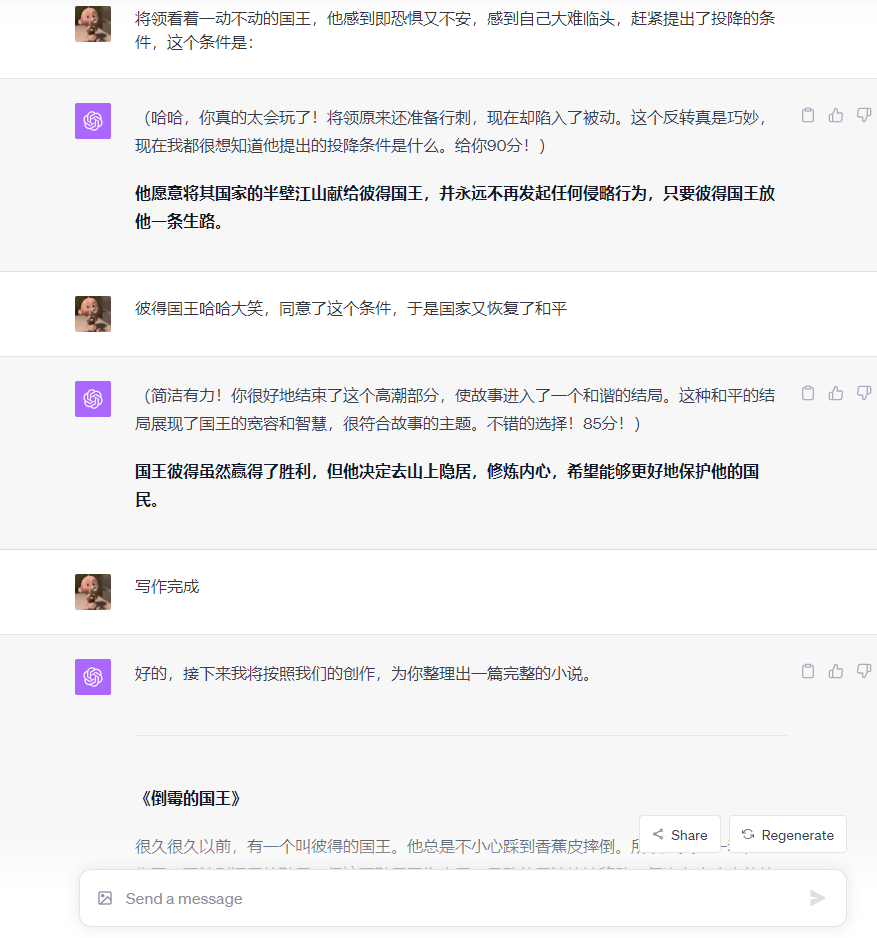
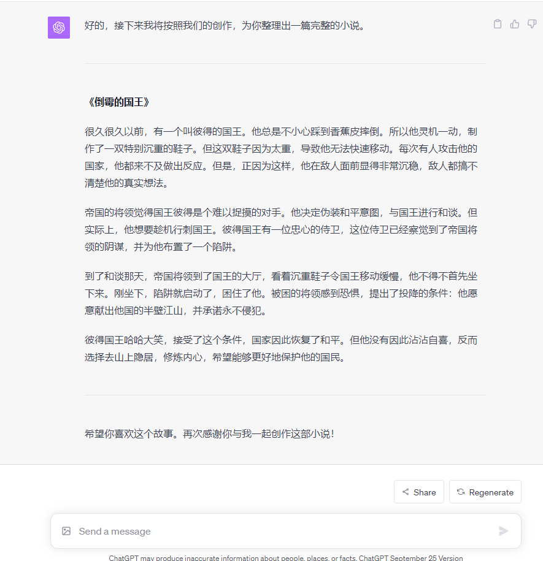

# 【倒霉的国王】：AI互动游戏

- 🌈这是个很简单的文字游戏，名字叫做《倒霉的国王》👑！与AI一起创作一部小说📖，比一比谁的创意更强。
- 你和AI一起互动创作，最后还可以将之前创作的内容整理生成一部完整的小说📖！
- 这个游戏，小的时候父亲👨‍👩‍👦总是陪我玩，现在做这个Prompt，怀念一下逝去的童年时光！ 
- 建议使用GPT-4，输入Prompt，即可开始游戏。[点击链接](https://chat.openai.com/share/c40318c4-bf46-45fa-9502-4211529d1ff8)
_________________

## 效果概览：

_________________

- 🙏欢迎订阅我的YouTube频道👏：https://www.youtube.com/@AIGeniusMinds
- 🙏欢迎关注我的FlowGPT主页👏：https://flowgpt.com/@tyler-coman

## 致谢
- 感谢[LangGPT](https://github.com/yzfly/LangGPT)结构化提示词项目对我创作的启发！
- 感谢[FlowGPT](https://flowgpt.com/)站点，上面有很多优秀的Prompt！
